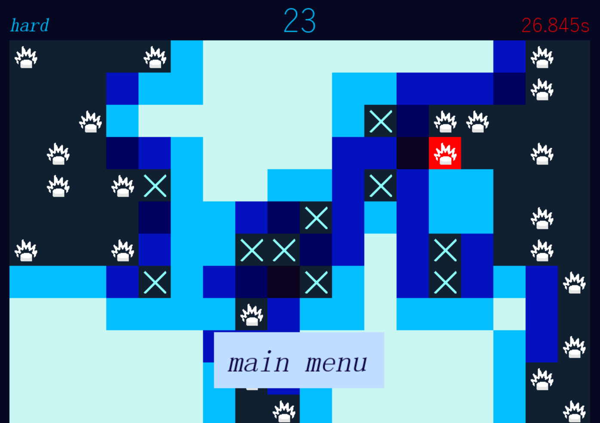

# Minesweeper

A simple Minesweeper game made in Python.  
This is not a showcase of elegant code – it's an old project with a fun playable game that i waste a lot of time playing.



## 🎯 About

This is a fully functional clone of the classic Minesweeper game. It includes features like:
- Grid generation with randomized mines
- Click to reveal or flag cells
- Click on multiple boxes at once
- Timer

## 🚀 Play It

You can [download the executable from the releases page](https://github.com/hugoeidem/minesweeper/releases) and run it on Windows without needing Python installed.

> Note: Since this was built with PyInstaller, Windows might show a security warning when running it. This is normal for unsigned executables.

## 🧠 Code Quality

This code was written a while ago and doesn't reflect my current coding style or standards.  
Still, it works and does the job — and that's something!

## 📦 Building the EXE

To build the executable yourself:

```bash
pip install pyinstaller pygame
pyinstaller --onefile --add-data "data;data" --windowed minesweeper.py